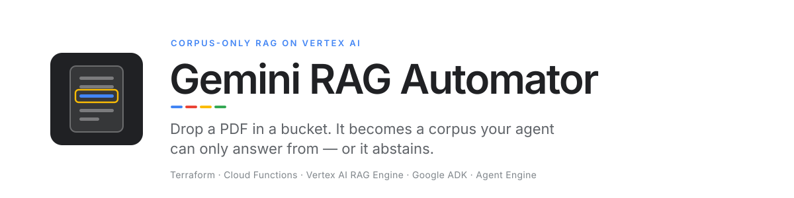
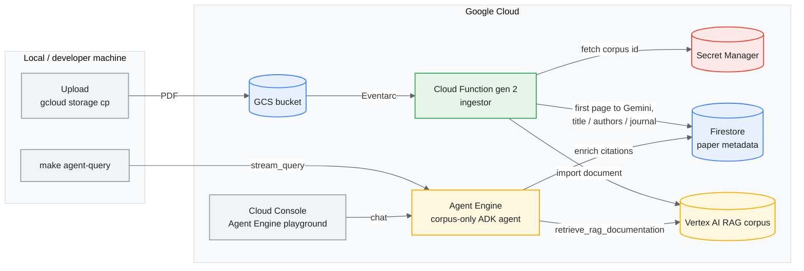
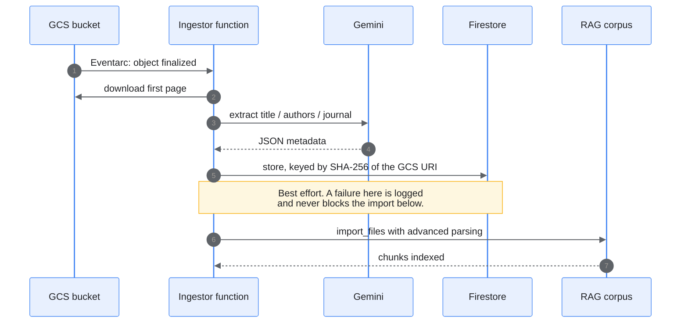
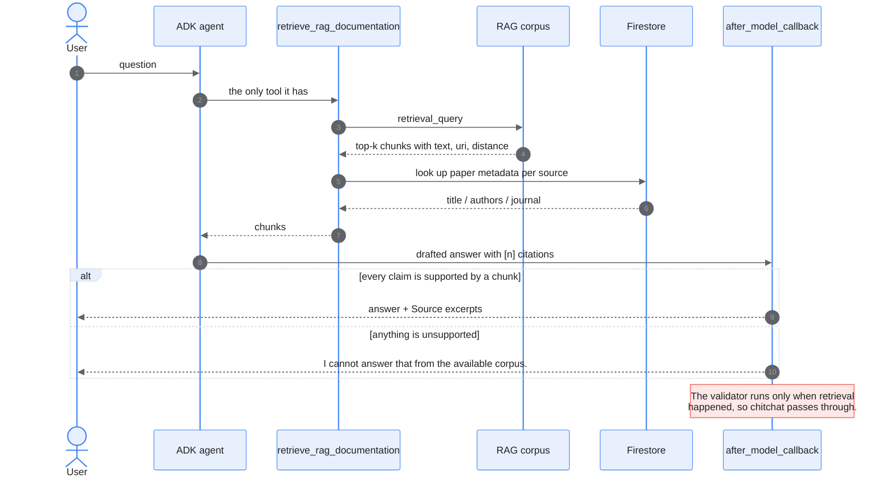

<picture>
  <source media="(prefers-color-scheme: dark)" srcset="docs/assets/banner-dark.svg">
  
</picture>

[](https://github.com/danielvogler/Gemini-Rag-Automator/actions/workflows/ci.yml)
[](./LICENSE)
[](https://www.python.org/downloads/)
[](https://docs.astral.sh/uv/)
[](https://adk.dev)
[](https://www.terraform.io/)
[](https://docs.astral.sh/ruff/)
[](https://pre-commit.com/)

---

## Start here

Clone it, then point your coding agent at **[AGENTS.md](./AGENTS.md)** and tell it
what you want to be able to ask questions about.

```
Read AGENTS.md and set this up. I want to be able to ask questions
about our geothermal papers and get answers with citations.
```

That file is written for exactly this. It covers the prerequisites worth
checking before anything is provisioned, the order the pieces have to come up
in, the one IAM grant Terraform cannot make for you, and how to tell whether
the thing actually works once it is deployed. You do not need to know the
project to start.

The rest of this page is what the agent is working from.

---

## What it does

This project provisions an automated ingestion pipeline using Terraform and a Gen-2 Cloud Function.
When a new PDF is uploaded to the designated Google Cloud Storage bucket, an Eventarc trigger fires to process the PDF and import it into a Managed Vertex AI RAG Corpus with Advanced Parsing enabled.

On top of that corpus sits an ADK agent whose only tool is a retrieval call
against it. It cannot reach the model's training memory or Google Search, and
an answer it cannot trace back to a retrieved chunk is replaced with a fixed
abstain string rather than shipped. Papers also get their title, authors and
journal read off page one at ingestion time, so a citation reads
`Vogler et al. — Geothermics` rather than `a7f3.pdf`.

## Architecture



### What happens when a PDF lands



### What happens when someone asks a question



## Setup & Pre-requisites
1. Copy `.env.example` to `.env` and fill in the target variables. `FIRESTORE_LOCATION` is required — `terraform apply` fails without it.
2. Ensure you have the `uv` toolchain installed for Python dependency management.
3. Authenticate with Google Cloud (`gcloud auth application-default login`).
4. Install Terraform.
5. Check whether the project already has a Firestore `(default)` database (`gcloud firestore databases list --project $GOOGLE_CLOUD_PROJECT`). Terraform creates one, and a project can only ever have one — in a mode that cannot be changed afterwards.

## Typical Workflow

1. **Deploy Infrastructure**: Run `make init` and `make tf-apply`.
2. **Initialize RAG Corpus**: Run `make init-rag` to create the Vertex corpus and save its ID to Secret Manager.
3. **Upload Documents**: Upload your PDFs to the provisioned GCS bucket. The Cloud Function will automatically ingest them into the Vertex AI RAG Corpus.
   ```bash
   # Make sure to source your .env first to get the variable, or type the bucket name manually
   source .env
   gcloud storage cp path/to/your_document.pdf gs://$GCS_BUCKET_NAME/
   ```
4. **Query the Data** (recommended path): Deploy the corpus-only ADK agent and query it — see the [Corpus-Only Agent](#corpus-only-agent-vertex-ai-agent-engine) section below. The legacy `make query Q="..."` still exists for quick debugging but uses the leaky server-side grounding path.

## Corpus-Only Agent (Vertex AI Agent Engine)

The repository ships a [Google ADK](https://github.com/google/adk-python) agent at [`src/agent/`](src/agent/) that you deploy to Vertex AI Agent Engine. **This is the path you should give end users** — not the raw RAG Engine corpus UI.

### Why the agent (and not the raw RAG UI)?

When you open a Vertex AI RAG corpus directly in the GCP Console, the test pane defaults to **Gemini 3 Flash with dynamic grounding**. Dynamic grounding blends three knowledge sources at generation time: your corpus, the model's parametric (training) memory, and — when configured — Google Search. The model decides which to weight. You cannot force corpus-only behaviour from that UI.

The agent at `src/agent/` removes that ambiguity. It exposes a single client-side function tool ([`retrieve_rag_documentation`](src/agent/tools.py)) that wraps `vertexai.preview.rag.retrieval_query()`. The model is shown ONLY that tool — no `google_search`, no server-side grounding wrapper that auto-rewrites on Gemini 2+. A strict system instruction tells the model to call the tool for factual questions, respond conversationally to chitchat, and abstain when chunks don't support a claim. An `after_model_callback` validates retrieval-based answers and rewrites unsupported text to the literal abstain string `"I cannot answer that from the available corpus."`. See [`src/agent/callbacks.py`](src/agent/callbacks.py) and [`src/agent/prompts.py`](src/agent/prompts.py).

### Behavioural guarantees

| Input | Output |
|---|---|
| Chitchat ("hi", "what can you do?") | Model responds naturally, no retrieval call, no citations |
| Factual question answered by corpus | Model retrieves, answers with inline `[n]` citations + Source excerpts |
| Factual question NOT answered by corpus | Model returns exactly `I cannot answer that from the available corpus.` |
| Any unsupported factual claim slipping past the model | `after_model_callback` rewrites to the abstain string |

### Citations

Every answer that used retrieval is followed by a `Source excerpts:` section
listing only the chunks the answer actually cited, each with the passage text
it was grounded in. The agent renders that itself rather than leaving it to the
caller, so it shows up identically in the Cloud Console playground and in
`make agent-query`.

Where paper metadata was extracted at ingestion, a citation is labelled
`Title — Authors (Journal)`; otherwise it falls back to the filename. The
lookup is keyed by a SHA-256 hash of the chunk's GCS URI, because Firestore
document IDs cannot contain `/`.

`vector_distance=` on each excerpt is the retrieval distance — **lower is
closer**. It is not a similarity score.

### Customer access paths

Once deployed via `make agent-deploy`, the agent is reachable in two ways:

1. **GCP Console "Try" pane** — open the deployed Agent Engine in Cloud Console and use its built-in chat. This is the recommended customer-facing UX.
2. **`make agent-query Q="..."`** — Python CLI that calls `stream_query` and renders the answer + source excerpts (chunk text shown beneath each citation).

Customers should NOT be sent to the raw RAG Engine corpus page in Cloud Console; it bypasses every defence layer this agent adds.

### Region note

This agent runs end-to-end in a single Vertex AI region (set by `AGENT_ENGINE_LOCATION` in `.env`). The same region MUST serve:

- The Vertex AI RAG corpus
- Vertex AI Agent Engine (where the agent is deployed)
- The Gemini model the agent uses

**`europe-west6` (Zürich) hosts RAG corpora but does NOT serve Gemini models** — so the agent cannot run there. Recommended regions: `europe-west1` (Belgium), `europe-west4` (Netherlands), `us-central1`. All three support RAG + Agent Engine + Gemini 2.5 Flash. Set `GOOGLE_CLOUD_LOCATION` and `AGENT_ENGINE_LOCATION` to the same value in `.env`.

### Service account

The deployed agent runs as the same service account used by the ingestor (`${SERVICE_ACCOUNT_ID}@${GOOGLE_CLOUD_PROJECT}.iam.gserviceaccount.com`). Terraform grants it `roles/aiplatform.user`. You must also grant the Agent Engine service identity (`service-${PROJECT_NUMBER}@gcp-sa-aiplatform-re.iam.gserviceaccount.com`) the `roles/iam.serviceAccountUser` role on that SA so it can `actAs`:

```bash
gcloud iam service-accounts add-iam-policy-binding \
  ${SERVICE_ACCOUNT_ID}@${GOOGLE_CLOUD_PROJECT}.iam.gserviceaccount.com \
  --member="serviceAccount:service-${PROJECT_NUMBER}@gcp-sa-aiplatform-re.iam.gserviceaccount.com" \
  --role="roles/iam.serviceAccountUser" \
  --project=${GOOGLE_CLOUD_PROJECT}
```

This step is one-time per project.

### Setup additions (on top of the existing workflow)

After `make tf-apply` (which provisions an `agent_engine_staging` GCS bucket) and `make init-rag`:

1. Verify the new env vars in `.env`: `AGENT_ENGINE_LOCATION`, `AGENT_MODEL_NAME`, `AGENT_DISPLAY_NAME`, `AGENT_STAGING_BUCKET_NAME`.
2. Grant the Agent Engine service identity `iam.serviceAccountUser` on the SA (see above).
3. `make agent-deploy` — builds and pushes the agent to Agent Engine. Writes `AGENT_ENGINE_ID` back into `.env`.
4. `make agent-query Q="your question"` — confirm the agent answers, cites, and shows source excerpts. Try a chitchat ("hi"), an in-corpus question, and an out-of-corpus question.

## Deploying Multiple Instances

If you wish to deploy another RAG automator in the same GCP project (e.g. for testing or a different environment), you must ensure the explicit names in your `.env` file are unique to avoid conflicts:
- Change `GCS_BUCKET_NAME` to a new unique bucket name.
- Change `GCP_SECRET_ID` to a new unique secret name (e.g. `GEMINI_RAG_CORPUS_ID_TEST`).
- Change `SERVICE_ACCOUNT_ID` to a new unique service account ID.
- Change `CLOUD_FUNCTION_NAME` to a new unique cloud function name.

## Available Commands

Run these commands using `make`:

**Infrastructure**

- `make init` : Initializes Terraform providers in the `terraform/` directory.
- `make tf-plan` : Plans the Terraform infrastructure using variables from your `.env` file.
- `make tf-apply` : Applies the Terraform configuration (creates the document bucket, the agent-engine staging bucket, the Cloud Function, IAM, etc.).
- `make tf-destroy` : Tears down all cloud resources managed by Terraform.

**Corpus & ingestion**

- `make init-rag` : Runs `scripts/init_rag_corpus.py` to create the Vertex AI RAG Corpus and store its ID in Secret Manager.
- `make list-files` : Lists all the PDFs successfully ingested into your Vertex AI RAG Corpus.
- `make ingest-test` : Local-only smoke test of the ingestion handler (pipes a mock filename to `gra-ingest`).

**Corpus-only agent (recommended customer-facing path)**

- `make agent-deploy` : Builds and deploys the ADK agent at `src/agent/` to Vertex AI Agent Engine. Idempotent — updates an existing deployment if `AGENT_DISPLAY_NAME` matches.
- `make agent-query Q="your question"` : Queries the deployed agent and renders the answer + citations. Add `STRUCTURED=1` to get JSON output.
- `make agent-run` : Launches the local ADK web UI for development against `src/agent/`.
- `make agent-delete` : Deletes the deployed Agent Engine instance referenced by `AGENT_ENGINE_ID`.

**Legacy / diagnostic**

- `make query Q="your question"` : ⚠️ Legacy. Uses the leaky `Tool.from_retrieval` grounding path — kept for debugging only. Use `make agent-query` for corpus-only answers.

**Repo hygiene**

- `make test` : Runs the `pytest` suite and writes test coverage to `logs/test_results.log`.
- `make pre-commit` : Runs pre-commit hooks on all files.
- `make clean` : Cleans up Terraform locks, cached state `.terraform`, and logs.

## File Boundaries
- `terraform/` : Infrastructure as Code (GCS buckets, Service Accounts, Secret Manager, Cloud Function, agent-engine staging bucket).
- `src/ingestor/` : Cloud Function code (the production ingestion handler).
- `src/local_ingestor/` : Local CLI (`gra-ingest`) for manually invoking the production ingestion handler from `src/ingestor/` against a GCS file (bypasses Eventarc).
- `src/agent/` : Google ADK corpus-only agent deployed to Vertex AI Agent Engine. Function-tool RAG retrieval, forced tool use, post-hoc answer validation, hard abstain on no-result.
- `scripts/` : Helper scripts — RAG corpus init, file listing, agent deploy, agent query, legacy query.
- `tests/` : pytest suite.
- `docs/assets/` : README banner (light and dark).
- `logs/` : Output logs of local executions and tests.
