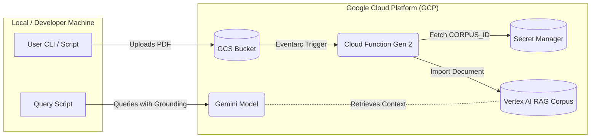

# Gemini RAG Automator

[](https://github.com/danielvogler/gemini-rag-automator/actions)
[](https://github.com/pre-commit/pre-commit)
[](https://www.python.org/downloads/release/python-3120/)
[](https://github.com/astral-sh/ruff)
[](https://www.terraform.io/)
[](https://cloud.google.com/)

This project provisions an automated ingestion pipeline using Terraform and a Gen-2 Cloud Function.
When a new PDF is uploaded to the designated Google Cloud Storage bucket, an Eventarc trigger fires to process the PDF and import it into a Managed Vertex AI RAG Corpus with Advanced Parsing enabled.

## Architecture



## Setup & Pre-requisites
1. Copy `.env.example` to `.env` and fill in the target variables.
2. Ensure you have the `uv` toolchain installed for Python dependency management.
3. Authenticate with Google Cloud (`gcloud auth application-default login`).
4. Install Terraform.

## Typical Workflow

1. **Deploy Infrastructure**: Run `make init` and `make tf-apply`.
2. **Initialize RAG Corpus**: Run `make init-rag` to create the Vertex corpus and save its ID to Secret Manager.
3. **Upload Documents**: Upload your PDFs to the provisioned GCS bucket. The Cloud Function will automatically ingest them into the Vertex AI RAG Corpus.
   ```bash
   # Make sure to source your .env first to get the variable, or type the bucket name manually
   source .env
   gcloud storage cp path/to/your_document.pdf gs://$GCS_BUCKET_NAME/
   ```
4. **Query the Data**: Wait a moment for the Cloud Function to finish ingestion, then run `make query Q="What is the document about?"`

## Deploying Multiple Instances

If you wish to deploy another RAG automator in the same GCP project (e.g. for testing or a different environment), you must ensure the explicit names in your `.env` file are unique to avoid conflicts:
- Change `GCS_BUCKET_NAME` to a new unique bucket name.
- Change `GCP_SECRET_ID` to a new unique secret name (e.g. `GEMINI_RAG_CORPUS_ID_TEST`).
- Change `SERVICE_ACCOUNT_ID` to a new unique service account ID.
- Change `CLOUD_FUNCTION_NAME` to a new unique cloud function name.

## Available Commands

Run these commands using `make`:

- `make init` : Initializes Terraform providers in the `terraform/` directory.
- `make tf-plan` : Plans the Terraform infrastructure using variables from your `.env` file.
- `make tf-apply` : Applies the Terraform configuration.
- `make tf-destroy` : Tears down all cloud resources managed by Terraform.
- `make init-rag` : Runs the Python script (`scripts/init_rag_corpus.py`) to create the Vertex AI RAG Corpus and store its ID in Secret Manager.
- `make query Q="your question"` : Queries the live Gemini model grounded against your ingested RAG documents.
- `make list-files` : Lists all the PDFs successfully ingested into your Vertex AI RAG Corpus.
- `make ingest-test` : Tests the ingestion locally via ADK CLI by piping a mock filename to the Cloud Function handler.
- `make test` : Runs the `pytest` suite and writes test coverage to `logs/test_results.log`.
- `make clean` : Cleans up Terraform locks, cached state `.terraform`, and logs in the `logs/` directory.

## File Boundaries
- `terraform/`: Infrastructure as Code for Cloud Storage, Service Accounts, Secret Manager, and Cloud Functions.
- `src/ingestor/`: Application code for the Cloud Function.
- `scripts/`: Helper scripts, such as RAG Corpus initialization.
- `src/adk/`: Embedded ADK CLI wrapper for local testing.
- `logs/`: Output logs of local executions and tests.
